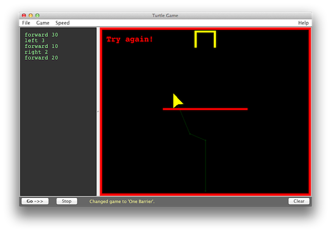

TurtleGame
==========

Fledgling beginnings of a turtle-like (as in LOGO, not mutant ninja) game for children - written in Java.

Screenshots
===========

Commands
========

* forward <steps>
* left <steps>
* right <steps>

Example
=======

    forward 3
    left 2
    forward 5
    right 2

The stage area is 100 steps x 100 steps, and a full circle is 16 rotation steps (so 4 rotation steps = 90 degrees).

Games
=====
* Simple - get the turtle into the yellow gate.
* One Barrier - get the turtle into the yellow gate without touching the red barrier.

Why?
====

A made-up computer game featured in a bedtime story that I invented for my 5-year-old daughter - this is the implementation of that idea.